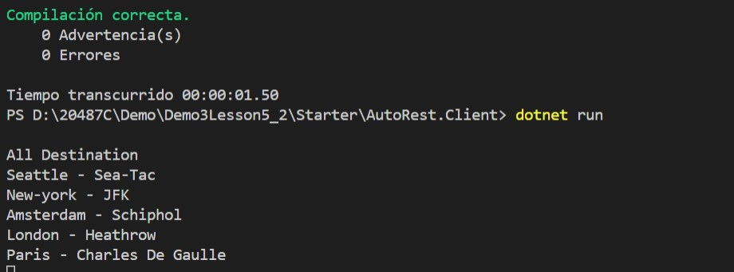

# Lesson 5: Automatically Generating HTTP Requests and Responses

### Demonstration: Generating C# HTTP Clients by Using AutoRest

- Abrimos el proyecto AutoRest en Visual Studio Code 

- Instalamos los paquetes de dependencia con npm en el subproyecto **AutoRest.Host**

- Ejecutamos

- EN el subproyecto **AutoRest.Sdk**  ejecutamos en la consola el siguiente codigo para que genere el codigo del swagger

  ```bash
  autorest -Input http://localhost:5000/swagger/v1/swagger.json -CodeGenerator CSharp -Namespace AutoRest.Sdk
  ```

- EN el subproyecto **AutoRest.client** modificamos el main para hacer la llamada al metodo get

- Ejecutamos el proyecto y recibimos los destinos

  




